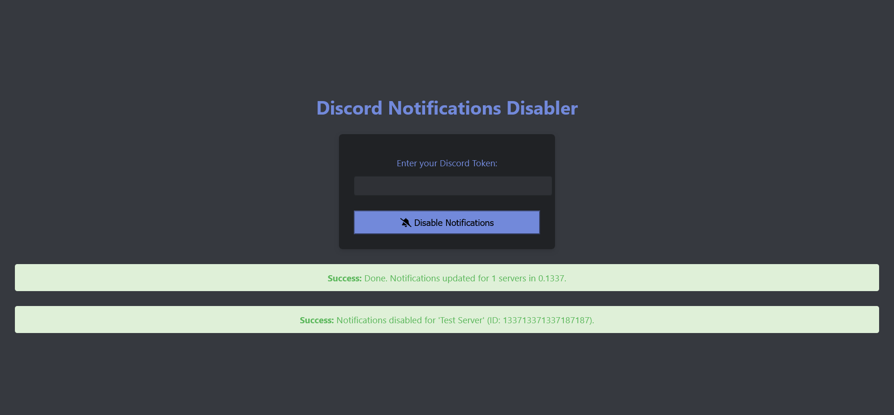

# Disable Discord Notifications

Script that disables notifications for each of your servers and sets them to "NOTHING".



## Installation

- Install dependencies using `npm i`
- Start the script using `npm run start`.

## NEVER SHARE YOUR TOKEN WITH ANYONE, IT GIVES FULL ACCESS TO YOUR ACCOUNT

```js
(webpackChunkdiscord_app.push([
  [""],
  {},
  (e) => {
    m = [];
    for (let c in e.c) m.push(e.c[c]);
  },
]),
m)
  .find((m) => m?.exports?.default?.getToken !== void 0)
  .exports.default.getToken();
```

Give it a star ⭐ and/or support me on [ko-fi](https://ko-fi.com/lonoxx)

# Support

> Website: [Panda-Network.de](https://panda-network.de) \
> Support [Discord Server](https://discord.gg/z8ScRvf)
